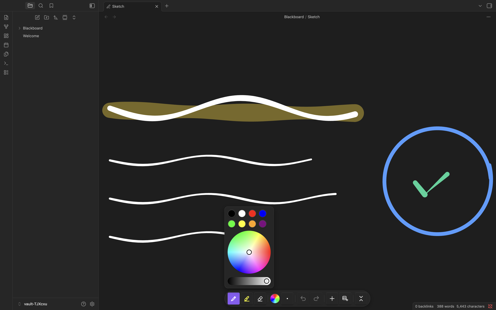
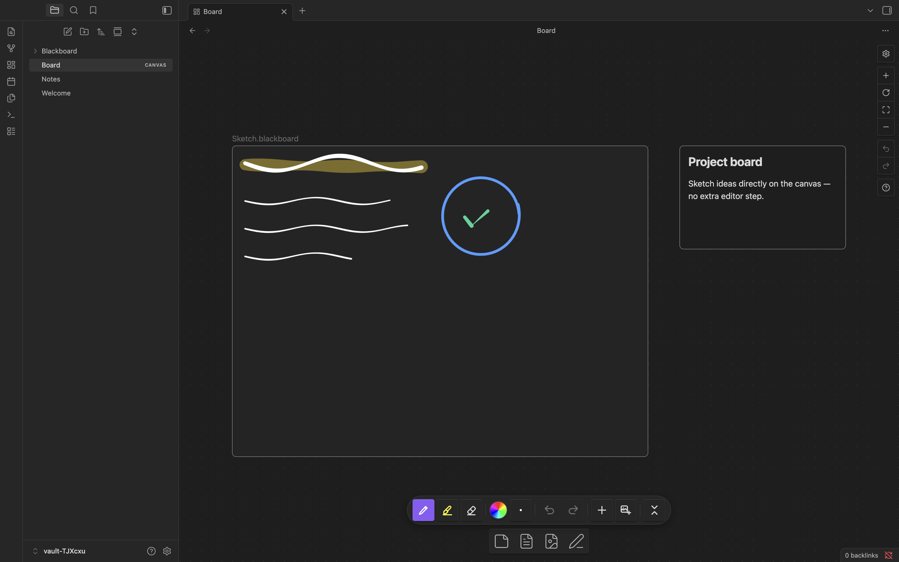
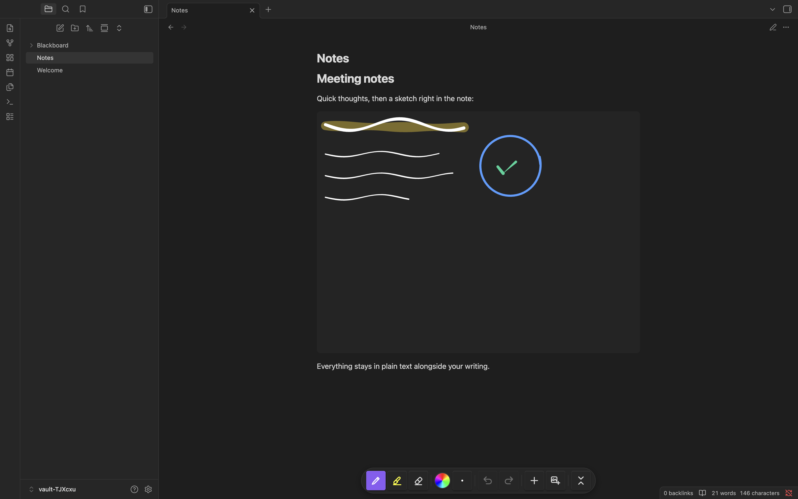
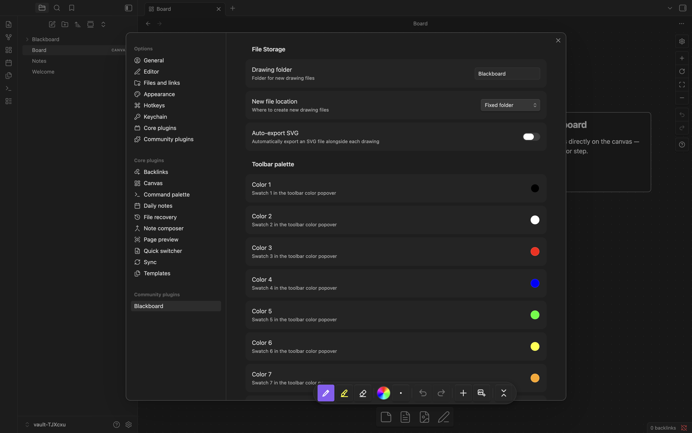

# Blackboard

Native stylus and Apple Pencil drawing for Obsidian.

Blackboard adds a `.blackboard` file type with pressure-sensitive freehand drawing and palm rejection, and lets you draw **directly** inside Obsidian Canvas nodes and Markdown embeds — no separate editor to open first. It is built for iPad with Apple Pencil, and works on desktop with a mouse.

<p align="center">
  
</p>

## Features

- **Pressure-sensitive drawing** — Apple Pencil and stylus support with variable-width strokes via [perfect-freehand](https://github.com/steveruizok/perfect-freehand).
- **Draw in place** — Pen-down draws immediately on a Canvas node or a Markdown embed; there is no click-to-open step.
- **Palm rejection** — A stylus always draws; a resting palm or finger never does. Touch is reserved for navigation (see below), so your hand can rest on the screen while you write.
- **Touch navigation** — In a standalone `.blackboard` view, one finger pans and two fingers pinch-zoom the infinite canvas; on desktop, hold **Space** and drag to pan. The stylus keeps drawing throughout.
- **Pen, highlighter, eraser** — Solid pen strokes, semi-transparent highlighter, and a stroke eraser.
- **Shared floating toolbar** — One toolbar follows the active drawing. Tool, color, and brush size are global across every drawing on the page; it collapses to a corner pill.
- **Per-embed sizing** — Each embed's display size is controlled by its host (the Canvas node's geometry, or the `|WxH` size on a Markdown embed), never baked into the file. Resizing scales the drawing without distortion; strokes are clipped to the node and never resize it.
- **Automatic SVG export (optional)** — Export a vector `.svg` alongside each drawing on save.
- **Plain-JSON files** — `.blackboard` files are human-readable JSON that diffs cleanly in Git.

## How it compares

Blackboard focuses on fast, native pen drawing that lives inside your notes and canvases. [Excalidraw](https://github.com/zsviczian/obsidian-excalidraw-plugin) is a full diagramming tool; [Ink](https://github.com/daledesilva/obsidian_ink) is another handwriting plugin. They're built for different things.

| | Blackboard | Excalidraw | Ink |
|---|:--:|:--:|:--:|
| Draw directly on a Canvas node (no open-to-edit step) | ✓ | ✗ | ✗¹ |
| Live drawing in a Markdown embed | ✓ | ✗ | ✓² |
| Strokes reliably persist on reload | ✓ | ✓ | ⚠️³ |
| Plain-text, git-diffable files | ✓ | ✗⁴ | ✗⁴ |
| Diagramming: shapes, arrows, text | ✗⁵ | ✓ | ✗ |
| Primary focus | pen drawing | diagramming | handwriting |

<sub>
¹ Ink has no Canvas-node drawing — <a href="https://github.com/daledesilva/obsidian_ink/issues/89">obsidian_ink#89</a> (open as of 0.3.4).<br>
² Ink renders editable drawings in Markdown embeds today.<br>
³ Ink drawings can disappear on reload — <a href="https://github.com/daledesilva/obsidian_ink/issues/125">obsidian_ink#125</a> (open as of 0.3.4).<br>
⁴ Excalidraw stores drawing data compressed by default; Ink stores the tldraw document model; Blackboard files are plain, human-readable JSON.<br>
⁵ Blackboard has no diagramming tools. When a drawing is placed in an Obsidian Canvas, the Canvas itself provides cards, arrows, and text alongside it.
</sub>

Need rich diagramming? Use [Excalidraw](https://github.com/zsviczian/obsidian-excalidraw-plugin) — it's excellent at it.

## Installation

### Manual

1. Download `main.js`, `manifest.json`, and `styles.css` from the [latest release](https://github.com/jameswolensky/obsidian-blackboard/releases).
2. Create the folder `<vault>/.obsidian/plugins/blackboard/`.
3. Copy the three files into it.
4. Enable **Blackboard** in **Settings → Community plugins**.

### BRAT

1. Install [BRAT](https://github.com/TfTHacker/obsidian42-brat).
2. **Add Beta Plugin** → `jameswolensky/obsidian-blackboard`.
3. Enable **Blackboard** in **Settings → Community plugins**.

## Usage

### Create a drawing

Run **Blackboard: New drawing** from the command palette. This creates a `.blackboard` file and opens it.

### The toolbar

A single floating toolbar follows whichever drawing is active. It holds the pen, highlighter, and eraser; a color control (preset swatches plus a color wheel); a brush-size control; undo/redo; and a button to collapse it to a small pill. Tool, color, and size apply to **every** drawing on the page — pick a color once and it stays as you move between drawings and switch tools.



### Embed in a Canvas

1. Open an Obsidian Canvas.
2. Use the Canvas card menu's drawing button, or **Blackboard: Insert drawing**, to add a drawing node.
3. Draw on it directly with a stylus. Resize the Canvas node to scale the drawing.



### Embed in a Markdown note

Embed a drawing like any file: `![[My Drawing.blackboard]]`. Set a size with the standard Obsidian syntax, e.g. `![[My Drawing.blackboard|640x480]]` or `![[My Drawing.blackboard|100%]]`. You can draw on the embed directly.



### Export

Enable **Auto-export SVG** in settings to write a `.svg` next to each drawing whenever it is saved (renames and deletes are kept in sync). Set **SVG export path** to collect exports in one folder.

## Commands

| Command | Description |
|---|---|
| New drawing | Create a new `.blackboard` file and open it |
| Insert drawing | Create a drawing and embed it at the cursor in a note, or as a node in the active Canvas |
| Insert existing drawing | Pick an existing `.blackboard` file and embed it at the cursor / in the active Canvas |

## Settings



| Setting | Default | Description |
|---|---|---|
| Drawing folder | `Blackboard` | Folder for new drawing files |
| New file location | Fixed folder | Create new drawings in the fixed folder, or alongside the active file |
| Auto-export SVG | Off | Write an `.svg` alongside each drawing on save |
| SVG export path | (same folder) | Folder for exported SVGs (shown when Auto-export SVG is on) |
| Toolbar palette (Color 1–8) | see below | The eight swatches in the toolbar color popover |
| Show toolbar pill | On | Show the collapsed pen-icon pill on Markdown/Canvas pages with no active drawing |

The default toolbar palette is `#000000`, `#ffffff`, `#ff0000`, `#0000ff`, `#00ff00`, `#ffff00`, `#ffa500`, `#800080`. Pen, highlighter, and eraser sizes and colors are chosen live from the floating toolbar; they are not separate settings.

## Compatibility

| Platform | Input | Notes |
|---|---|---|
| iPad + Apple Pencil | Full pressure | Primary target |
| iPad (touch) | Navigation only | One finger pans, two-finger pinch zooms; the stylus draws |
| Android tablet + stylus | Pressure varies by device | Supported |
| Desktop (mouse) | Uniform width (no pressure) | Supported |

## File format

`.blackboard` files are JSON:

```json
{
  "version": 3,
  "width": 320,
  "height": 240,
  "strokes": [
    {
      "id": "abc123",
      "tool": "pen",
      "color": "#ffffff",
      "size": 2,
      "opacity": 1,
      "points": [[100, 200, 0.5], [101, 201, 0.6]],
      "hasPressure": true,
      "timestamp": 1711281600000
    }
  ],
  "background": { "color": "transparent" },
  "contentBounds": { "x": 80, "y": 180, "width": 60, "height": 50 }
}
```

Each stroke is an array of `[x, y, pressure]` points in drawing-space. `width`/`height` and `contentBounds` cache the strokes' bounding box for previews and are recomputed from the strokes; display size is decided by each embed, not the file. Files from earlier versions are read without loss.

## Development

Requires **Node.js 24** and npm.

```bash
npm install
npm run dev      # watch build
npm run build    # production build
npm test         # unit tests (Vitest)
npm run check    # typecheck + tests + build
```

iPad-specific rendering (Apple WebKit) can't be reproduced by the desktop/Electron test runner; verify anything iPad-specific manually in the iOS Simulator (requires Xcode). The static harnesses in `test/webkit/` render the toolbar and engine in real WebKit for that.

See [CONTRIBUTING.md](CONTRIBUTING.md) for the contribution workflow and conventions.

## License

[MIT](LICENSE) © James Wolensky
